# Vòng đời trong Flutter

Vòng đời trong flutter mình có thể phân biệt qua 3 loại vòng đời.

1. **Vòng đời của Widget** trong Flutter? (StatefulWidget, StatelessWidget)  
2. **App Lifecycle** (vòng đời của ứng dụng, như khi ứng dụng chạy nền, bị tạm dừng)?  
3. **Cách sử dụng lifecycle để quản lý trạng thái ứng dụng?**  

## 1. **Vòng đời của Widget** trong Flutter

### **1️⃣ StatelessWidget (Không có trạng thái)**
- Chỉ có phương thức `build()`
- Không thay đổi trạng thái sau khi tạo
- Dùng cho UI cố định

```mermaid
graph TD
  A[StatelessWidget] -->|Gọi build| B[Hiển thị UI]
  B -->|Không thay đổi| B
```



### **2️⃣ StatefulWidget (Có trạng thái)**
- Có thể thay đổi trạng thái
- Gồm 2 phần: **StatefulWidget** (chỉ tạo một lần) và **State** (quản lý trạng thái)
- Gồm 6 giai đoạn chính trong vòng đời

```mermaid
graph TD
  A[StatefulWidget] -->|createState| B[State_Object]
  B -->|initState| C[Khởi tạo biến và sự kiện]
  C -->|didChangeDependencies| D[Xử lý khi phụ thuộc thay đổi]
  D -->|build| E[Hiển thị UI]
  E -->|Người dùng nhấn nút: setState| E
  E -->|Widget cha thay đổi| F[didUpdateWidget]
  E -->|Widget bị xóa| G[dispose]
  G -->|Dọn dẹp tài nguyên| H[Hoàn thành vòng đời]
```


### 🔍 **Hành vi ứng dụng:**
1. **Khi khởi tạo**:  
   `createState()` → `initState()` → `didChangeDependencies()` → `build()`
2. **Khi nhấn nút "Increase Counter"**:  
   Chỉ có `build()` được gọi lại.
3. **Khi widget cha thay đổi**:  
   `didUpdateWidget()` chạy.
4. **Khi đóng ứng dụng**:  
   `dispose()` chạy để giải phóng tài nguyên.


## 2. **App Lifecycle**

```plaintext
+----------------------------+
|        App Lifecycle       |
+----------------------------+
           |
           v
+----------------------------+
|        resumed             | <---------------------------+
|  Ứng dụng đang hiển thị    |                             |
|  Người dùng có thể tương tác|                             |
+----------------------------+                             |
           |                                              |
           v                                              |
+----------------------------+                            |
|        inactive            |                            |
|  Ứng dụng hiển thị nhưng   |                            |
|  không nhận tương tác      |                            |
+----------------------------+                            |
           |                                              |
           v                                              |
+----------------------------+                            |
|        paused              |                            |
|  Ứng dụng bị đẩy vào nền   |                            |
+----------------------------+                            |
           |                                              |
           v                                              |
+----------------------------+                            |
|        detached            |                            |
|  Ứng dụng bị hủy nhưng     |                            |
|  chưa đóng hoàn toàn       |                            |
+----------------------------+                            |
           |                                              |
           +----------------------------------------------+
```

### Mô tả luồng trạng thái:
- Khi ứng dụng đang hoạt động bình thường, nó ở trạng thái **resumed**.
- Nếu người dùng rời ứng dụng (ví dụ: có cuộc gọi đến), ứng dụng chuyển sang **inactive**.
- Nếu ứng dụng bị đẩy vào background (ví dụ: người dùng nhấn nút Home), nó chuyển sang **paused**.
- Nếu ứng dụng bị hủy hoàn toàn (do hệ thống đóng hoặc bị tắt), nó vào trạng thái **detached**.

### Ví dụ
- **inactive** : Ứng dụng hiện thị nhưng không tương tác.
    **Ví dụ:**
    - Khi người user đang dùng ứng dụng nhưng có một cuộc gọi đến và màn hình vẫn hiện thị nhưng ko tương tác được
    - Khi ứng chung cho phép google hay bên thứ 3 thông báo quyền truy cập,...
 
- **paused** : ảy ra khi ứng dụng bị đẩy vào background nhưng chưa bị đóng hoàn toàn.
  **Ví dụ:**
  - Người dùng nhấn nút Home
  - Chuyển sang ứng dụng khác
  - Màn hình điện thoại tắt (sleep mode)

- **detached** : khi ứng dụng bị hủy nhưng chưa hoàn toàn đóng.
  **Ví dụ:**
  - Khi người dùng vuốt tắt ứng dụng khỏi danh sách ứng dụng đang chạy (Recent Apps trên Android hoặc iOS).
  - Khi điện thoại thiếu RAM, hệ điều hành có thể giết ứng dụng để giải phóng bộ nhớ. Lúc này, ứng dụng sẽ chuyển sang trạng thái detached.

### Cách theo dõi vòng đời ứng dụng
Sử dụng `WidgetsBindingObserver` để lắng nghe thay đổi trạng thái như trong đoạn code mẫu bạn đã cung cấp.

